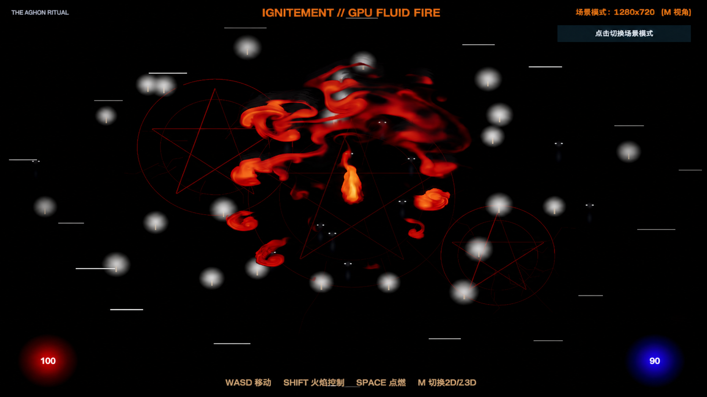

# Real-Time GPU Fluid Fire — Unity 6 Technical VFX Showcase

An interactive real-time fluid-fire prototype built in Unity 6.3 LTS. The effect uses a GPU RenderTexture grid simulation instead of a conventional particle system or sprite sheet.

## Technical highlights

- BFECC/MacCormack advection
- Multi-scale vorticity confinement
- Pressure projection, combustion, and smoke state
- Blurred light field and 16-layer pseudo-volumetric rendering
- C# simulation pipeline with custom shaders
- Interactive controls and 2D/2.5D view switching

## Public showcase contents

This repository intentionally contains only a portfolio preview image and high-level project information. It does **not** contain the Unity project, source code, shaders, reusable assets, paid assets, or project settings.

## Availability

I can help with Unity prototypes, gameplay systems, technical VFX, custom shaders, editor tools, performance investigation, and bug fixes.

[View my Upwork profile](https://www.upwork.com/freelancers/~0143439f6a710d7829)

## Rights

All materials in this repository are provided for portfolio viewing only. No license to copy, redistribute, modify, resell, train models on, or reuse the artwork, design, implementation, or project materials is granted. See [COPYRIGHT.md](COPYRIGHT.md).
